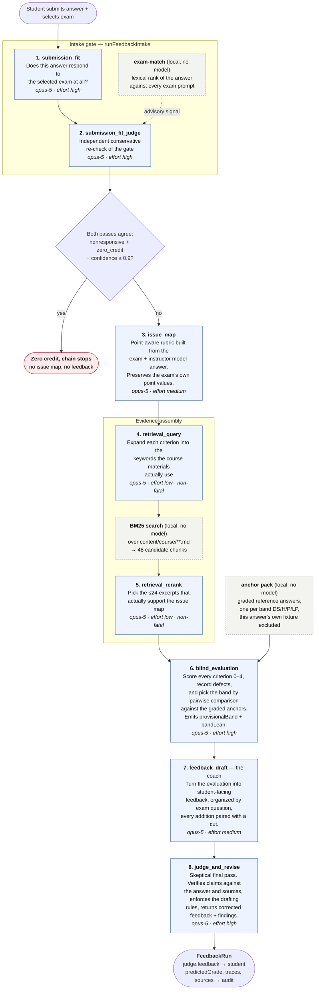
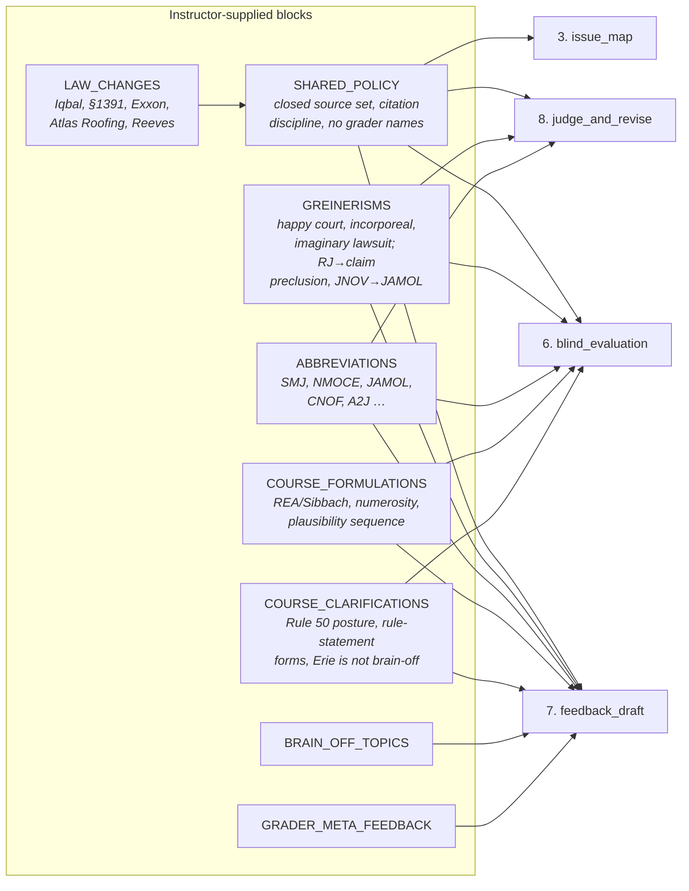
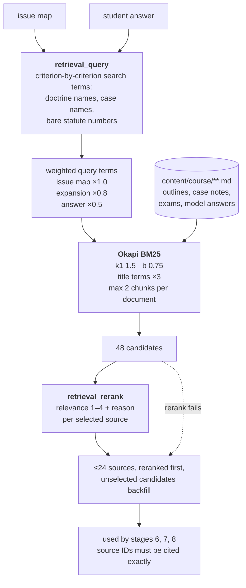
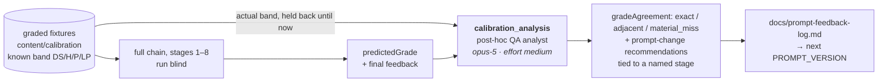
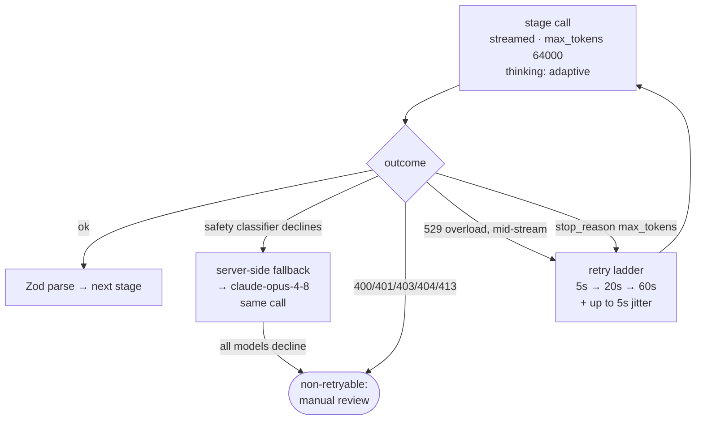

# The student-feedback prompt chain

Prompt version `civpro-feedback-v4.15.0` · source of truth: `src/lib/feedback-chain.ts`, `src/lib/prompts.ts`

Every box below is one Claude call made through `parseClaudeStage()`. Each call is a
structured-output call: a developer/system prompt, one user message, and a Zod schema the
model must fill. No stage sees a later stage's output, and no stage sees the student's real
grade.

---

## 1. The live chain, end to end

---

## 2. What each stage is given and what it returns

| # | Stage | Developer prompt | User-message inputs | Schema out | Model · effort |
|---|-------|------------------|---------------------|-----------|----------------|
| 1 | `submission_fit` | `submissionFitDeveloperPrompt` | exam prompt, student answer | `SubmissionFitAssessmentSchema` | opus-5 · high |
| 2 | `submission_fit_judge` | `submissionFitJudgeDeveloperPrompt` | exam, answer, first-pass result, local exam-match ranking | `SubmissionFitJudgeSchema` | opus-5 · high |
| 3 | `issue_map` | `rubricDeveloperPrompt` | exam, instructor model answer | `IssueMapSchema` | opus-5 · medium |
| 4 | `retrieval_query` | `queryExpansionDeveloperPrompt` | issue map, answer | `RetrievalQuerySchema` | opus-5 · low |
| 5 | `retrieval_rerank` | `sourceRerankDeveloperPrompt` | issue map, answer, 48 BM25 candidates | `SourceRerankSchema` | opus-5 · low |
| 6 | `blind_evaluation` | `evaluationDeveloperPrompt` | exam, model answer, issue map, answer, **anchor pack**, ≤24 sources | `EvaluationSchema` | opus-5 · high |
| 7 | `feedback_draft` | `coachDeveloperPrompt` | answer, issue map, evaluation, sources | `FeedbackSchema` | opus-5 · medium |
| 8 | `judge_and_revise` | `judgeDeveloperPrompt` | exam, model answer, answer, issue map, evaluation, **draft feedback**, sources | `JudgeSchema` | opus-5 · high |

Note what stage 7 does *not* receive: the exam prompt, the model answer, and the anchors.
The coach works from the evaluation's findings, so the band comparison cannot leak into the
student-facing prose. Stage 8 gets everything back so it can check the coach against the record.

---

## 3. Shared prompt blocks — who gets what

The instructor-supplied material lives in `src/lib/prompts.ts` as named constants that are
interpolated into several developer prompts. This is the injection matrix:

Stages 1, 2, 4 and 5 carry none of it — the gate and the retrieval stages have no business
grading, so they are kept deliberately thin.

---

## 4. Retrieval, in detail

There is no embeddings endpoint in the Claude API, so the "semantic" half of retrieval is
stage 4: Claude names the vocabulary the course materials would use, and BM25 matches it
lexically. If stage 4 or 5 fails, the run continues on raw BM25 order rather than aborting.

---

## 5. The offline calibration loop

This does not touch a student run. It grades known fixtures whose real bands are held back
from the chain, then compares.

The analyst is explicitly told the band recommendation comes from stage 6 — there is no
separate band-calibration stage in current runs — so a banding defect is attributed to
`blind_evaluation`.

---

## 6. Reliability behavior

Applies to every stage uniformly, from `parseClaudeStage()`:

Every completed stage appends a `StageTrace`: the model that actually answered (which is the
fallback model when a fallback served the turn), effort, duration, token counts, response ID.
That trace array is what the audit and QA pages render.

---

## 7. Legacy, for reference

Older runs in the store carry two shapes the current chain no longer produces:

- **`dualDecision` / cross-judge** — a two-provider pipeline whose cross-judge picked the
  final band and feedback. `getFinalFeedback()` still prefers it when present, so archived
  runs render correctly; nothing writes it today. Current runs are `pipeline: "single"`.
- **`bandAssessment`** — a separate band-calibration stage, folded into `blind_evaluation`.
  The calibration analyst may only attribute a defect to `band_calibration` when analyzing
  one of those older runs.
